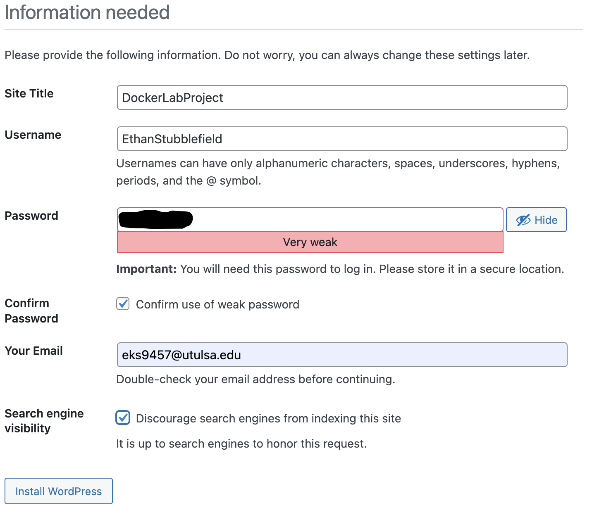
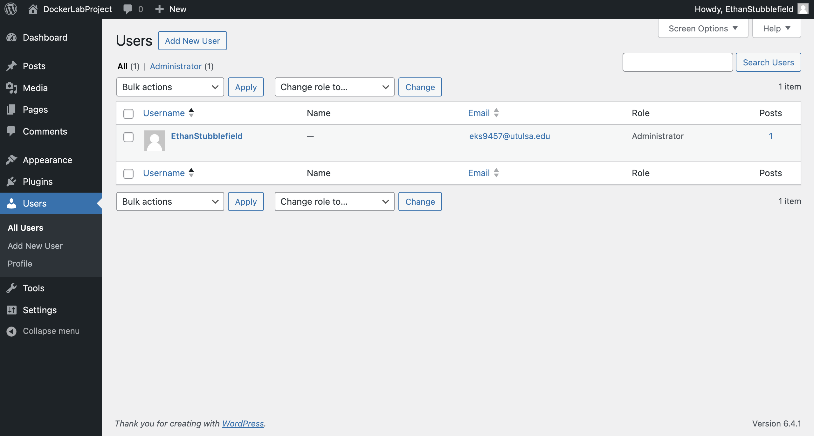
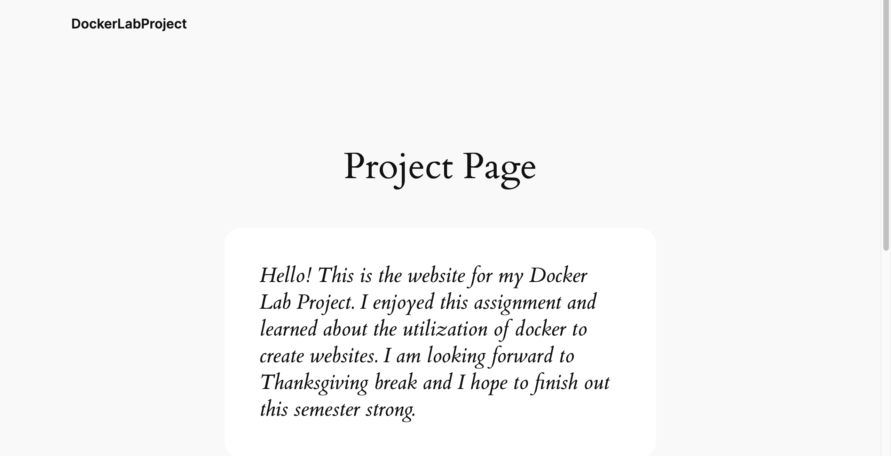

# Docker Project (WordPress option)

## Step 1 - Docker Install

Initially, I was going to do this assignment on an Ubuntu VM with VMware. However, I ran into many issues like installing the Docker package and accessing/running it. After many hours of trial and error, I decided to stop digging myself a time-wasting hole and scrap the ubuntu approach.

I choose to take a simpler path with installing Docker via MacOS.

First I installed Docker Desktop on my Mac by going to the website [docker.com](https://www.docker.com/products/docker-desktop/) and installing the dmg file for MacOS (intel).

Next, I went though the basic configuration and setup in the Docker Desktop application.

## Step 2 - WordPress Setup

For steps 2 & 3, I followed the guide at [hostinger.com](https://www.hostinger.com/tutorials/run-docker-wordpress).

I went to the top searchbar in the Docker Desktop and added `WordPress`, `MySQL`, and `phpMyAdmin`. I did this by finding the container from the Docker Hub and clicked the pull option next to the container. 

After installing the containers, I opened the terminal and ensured my Docker Compose was running with the following command:

```
% docker compose version
```
After that, I changed my directory to my desktop and created a directory named workpress. I did so with these 2 commands:

```
% cd Desktop
% mkdir wordpress
```

Next I opened VScode and created a .yml file named; `docker-compose.yml`. I then proceeded to write the following script:
```
version: "3" 
# Defines which compose version to use
services:
  # Services line define which Docker images to run. In this case, it will be MySQL server and WordPress image.
  db:
    image: mysql:5.7
    # image: mysql:5.7 indicates the MySQL database container image from Docker Hub used in this installation.
    restart: always
    environment:
      MYSQL_ROOT_PASSWORD: MyR00tMySQLPa$$5w0rD
      MYSQL_DATABASE: MyWordPressDatabaseName
      MYSQL_USER: MyWordPressUser
      MYSQL_PASSWORD: Pa$$5w0rD
      # Previous four lines define the main variables needed for the MySQL container to work: database, database username, database user password, and the MySQL root password.
  wordpress:
    depends_on:
      - db
    image: wordpress:latest
    restart: always
    # Restart line controls the restart mode, meaning if the container stops running for any reason, it will restart the process immediately.
    ports:
      - "8000:80"
      # The previous line defines the port that the WordPress container will use. After successful installation, the full path will look like this: http://localhost:8000
    environment:
      WORDPRESS_DB_HOST: db:3306
      WORDPRESS_DB_USER: MyWordPressUser
      WORDPRESS_DB_PASSWORD: Pa$$5w0rD
      WORDPRESS_DB_NAME: MyWordPressDatabaseName
# Similar to MySQL image variables, the last four lines define the main variables needed for the WordPress container to work properly with the MySQL container.
    volumes:
      ["./:/var/www/html"]
volumes:
  mysql: {}
```

I then moved the `docker-compose.yml` file to the wordpress directory with this command (in hindsight, I could've just dragged the file into the wordpress folder):

```
% mv docker-compose.yml wordpress
```

I then moved into the wordpress directory:

```
% cd wordpress
```

Finally, I ran this command inside the wordpress directory to start the containers:

```
% docker compose up -d
```

## Step 3 - WordPress Configuration

I went to my browser (Google) and went to the following hyperlink:

```
http://localhost:8000/
```

I then filled out the following information into the provided fields on the website:



After creating the account, it brings me to the dashboard of wordpress.

Lastly, I navigate to Users section. There I can see my created user (EthanStubblefield) with administrator privileges. Below is an image proving my admin status. 



## Step 4 - Website Creation

For the final step, I created a page. 

I navigated to the Pages section. Hovering over the sample page I clicked edit. Then I edited the page and configured it. Below is a screenshot of my webpage.



